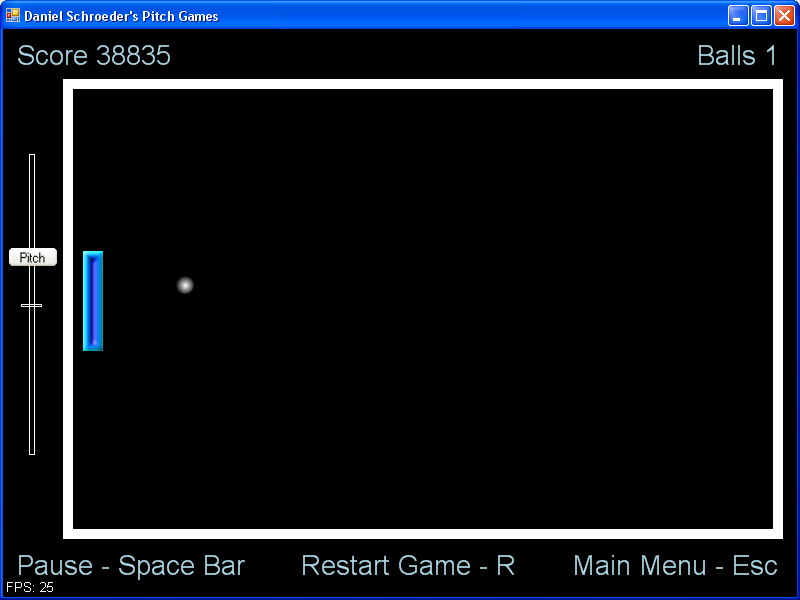

# Daniel Schroeder's Pitch Games

Daniel Schroeder's Pitch Games is a series of mini-games where you control the game using the pitch of your voice.
The mini-games include single player pong, a pitch matching game where you must try and match the pitch of your voice to the pitch shown on the screen, and a bow and arrow game where you must hit a target with an arrow where the pitch of your voice controls the ark of the arrow, and the amplitude of your voice controls how much power the arrow is fired with.

## Play it

To play the game, you'll need to clone the repository (or download it as a zip) and then follow [the setup instructions](src/External%20Dependencies/Setup%20Instructions.txt).

## History

I created this game in 2008 while taking the CS827 graduate audio class.
This game was programmed in C# and simply uses GDI+ for the graphics, so DirectX does not need to be installed to play it.
It uses PD (Pure Data) to get the player's voice input from a microphone and to detect their pitch, and then transfers this information to the C# code using OSC (Open Sound Control).

Since this was created for a class project, in the repository you'll also find the report and presentation that I submitted 🙂

I've uploaded the code for posterity sake.
Feel free to check out [the source code](src/) 🙂
However, please don't judge me by it as it was written near the start of my programming career when I still had much to learn 😉
